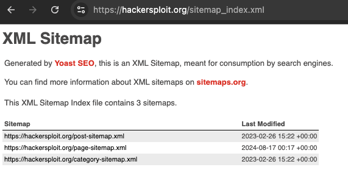

# Passive Information Gathering

## Getting The Ip Address Of A Domain

```
$ host hackersploit.org        
hackersploit.org has address 104.21.112.1
hackersploit.org has address 104.21.16.1
hackersploit.org has address 104.21.32.1
hackersploit.org has address 104.21.48.1
hackersploit.org has address 104.21.96.1
hackersploit.org has address 104.21.80.1
hackersploit.org has address 104.21.64.1
hackersploit.org has IPv6 address 2606:4700:3030::6815:2001
hackersploit.org has IPv6 address 2606:4700:3030::6815:3001
hackersploit.org has IPv6 address 2606:4700:3030::6815:7001
hackersploit.org has IPv6 address 2606:4700:3030::6815:5001
hackersploit.org has IPv6 address 2606:4700:3030::6815:6001
hackersploit.org has IPv6 address 2606:4700:3030::6815:1001
hackersploit.org has IPv6 address 2606:4700:3030::6815:4001
hackersploit.org mail is handled by 0 _dc-mx.2c2a3526b376.hackersploit.org.
```

About the [host command](https://linux.die.net/man/1/host)

As you can see by the output above, a few IPv4 and IPv6 address were returned, this is because the site is behind cloudflare.

## Exploring robots.txt

```
wget hackersploit.org/robots.txt
--2025-07-22 15:51:08--  http://hackersploit.org/robots.txt
Resolving hackersploit.org (hackersploit.org)... 104.21.32.1, 104.21.64.1, 104.21.96.1, ...
Connecting to hackersploit.org (hackersploit.org)|104.21.32.1|:80... connected.
HTTP request sent, awaiting response... 301 Moved Permanently
Location: https://hackersploit.org/robots.txt [following]
--2025-07-22 15:51:08--  https://hackersploit.org/robots.txt
Connecting to hackersploit.org (hackersploit.org)|104.21.32.1|:443... connected.
HTTP request sent, awaiting response... 200 OK
Length: unspecified [text/plain]
Saving to: ‘robots.txt’

robots.txt                                 [ <=>                                                                        ]     252  --.-KB/s    in 0s      

2025-07-22 15:51:09 (30.0 MB/s) - ‘robots.txt’ saved [252]
```

```
$ cat robots.txt 
User-agent: *
Disallow: /wp-content/uploads/wpo/wpo-plugins-tables-list.json

# START YOAST BLOCK
# ---------------------------
User-agent: *
Disallow:

Sitemap: https://hackersploit.org/sitemap_index.xml
# ---------------------------
# END YOAST BLOCK%   
```

As you can see ` /wp-content/uploads/wpo/wpo-plugins-tables-list.json` is disabled, this tell us that the site is using Wordpress.

## sitemap.xml

`sitemap.xml` or `sitemaps.xml`  is a special file on a website that lists all the important pages so search engines like Google can easily find and index them.

In short, it’s like a map for search engines to understand your site’s structure and content.



> https://hackersploit.org/sitemap_index.xml


https://chromewebstore.google.com/detail/builtwith-technology-prof/dapjbgnjinbpoindlpdmhochffioedbn?hl=es

https://chromewebstore.google.com/detail/wappalyzer-technology-pro/gppongmhjkpfnbhagpmjfkannfbllamg?hl=es

whatweb command


## Download An Entire Website

https://www.httrack.com/

## Whois Enumeration

The `whois` command is a client utility that queries a distributed database system called `WHOIS`.

WHOIS is independent from DNS, but they are related:

- DNS resolves a domain name → IP address.
- WHOIS retrieves registry information about that domain (who owns it, when it was registered, etc.).

> The whois client might do a DNS lookup first (to find the correct WHOIS server) but the actual query is not a DNS query—it’s a plain TCP request.

The WHOIS database isn’t a single global database—it’s a distributed system maintained by many different organizations.

The whois client is available via command line, although you can use public pages like https://who.is

```
whois hackersploit.org
% IANA WHOIS server
% for more information on IANA, visit http://www.iana.org
% This query returned 1 object

refer:        whois.publicinterestregistry.org

domain:       ORG

organisation: Public Interest Registry (PIR)
address:      11911 Freedom Drive,
address:      10th Floor, Suite 1000
address:      Reston VA 20190
address:      United States of America (the)

contact:      administrative
name:         Director of Operations, Compliance and Customer Support
organisation: Public Interest Registry (PIR)
address:      11911 Freedom Drive,
address:      10th Floor, Suite 1000
address:      Reston VA 20190
address:      United States of America (the)
phone:        +1 703 889 5778
fax-no:       +1 703 889 5779
e-mail:       ops@pir.org

contact:      technical
name:         Senior Director, DNS Infrastructure Group
organisation: Donuts Inc.
address:      10500 NE 8th Street, Suite 750
address:      Bellevue WA 98004
address:      United States of America (the)
phone:        1.425.298.2200
fax-no:       1.425.671.0020
e-mail:       tldtech@donuts.email

nserver:      A0.ORG.AFILIAS-NST.INFO 199.19.56.1 2001:500:e:0:0:0:0:1
nserver:      A2.ORG.AFILIAS-NST.INFO 199.249.112.1 2001:500:40:0:0:0:0:1
nserver:      B0.ORG.AFILIAS-NST.ORG 199.19.54.1 2001:500:c:0:0:0:0:1
nserver:      B2.ORG.AFILIAS-NST.ORG 199.249.120.1 2001:500:48:0:0:0:0:1
nserver:      C0.ORG.AFILIAS-NST.INFO 199.19.53.1 2001:500:b:0:0:0:0:1
nserver:      D0.ORG.AFILIAS-NST.ORG 199.19.57.1 2001:500:f:0:0:0:0:1
ds-rdata:     26974 8 2 4fede294c53f438a158c41d39489cd78a86beb0d8a0aeaff14745c0d16e1de32

whois:        whois.publicinterestregistry.org

status:       ACTIVE
remarks:      Registration information:
remarks:      http://publicinterestregistry.org

created:      1985-01-01
changed:      2022-06-03
source:       IANA

# whois.publicinterestregistry.org

Domain Name: hackersploit.org
Registry Domain ID: 77f8fe62a425487cbefef4bf7e27d2ec-LROR
Registrar WHOIS Server: whois.namecheap.com
Registrar URL: http://www.namecheap.com
Updated Date: 2025-01-07T14:38:39Z
Creation Date: 2018-04-05T11:27:07Z
Registry Expiry Date: 2026-04-05T11:27:07Z
Registrar: NameCheap, Inc.
Registrar IANA ID: 1068
Registrar Abuse Contact Email: abuse@namecheap.com
Registrar Abuse Contact Phone: +1.9854014545
Domain Status: clientTransferProhibited https://icann.org/epp#clientTransferProhibited
Registry Registrant ID: REDACTED
Registrant Name: REDACTED
Registrant Organization: Privacy service provided by Withheld for Privacy ehf
Registrant Street: REDACTED
Registrant City: REDACTED
Registrant State/Province: Capital Region
Registrant Postal Code: REDACTED
Registrant Country: IS
Registrant Phone: REDACTED
Registrant Phone Ext: REDACTED
Registrant Fax: REDACTED
Registrant Fax Ext: REDACTED
Registrant Email: REDACTED
Registry Admin ID: REDACTED
Admin Name: REDACTED
Admin Organization: REDACTED
Admin Street: REDACTED
Admin City: REDACTED
Admin State/Province: REDACTED
Admin Postal Code: REDACTED
Admin Country: REDACTED
Admin Phone: REDACTED
Admin Phone Ext: REDACTED
Admin Fax: REDACTED
Admin Fax Ext: REDACTED
Admin Email: REDACTED
Registry Tech ID: REDACTED
Tech Name: REDACTED
Tech Organization: REDACTED
Tech Street: REDACTED
Tech City: REDACTED
Tech State/Province: REDACTED
Tech Postal Code: REDACTED
Tech Country: REDACTED
Tech Phone: REDACTED
Tech Phone Ext: REDACTED
Tech Fax: REDACTED
Tech Fax Ext: REDACTED
Tech Email: REDACTED
Name Server: dee.ns.cloudflare.com
Name Server: jim.ns.cloudflare.com
DNSSEC: unsigned
URL of the ICANN Whois Inaccuracy Complaint Form: https://icann.org/wicf/
>>> Last update of WHOIS database: 2025-07-23T00:52:48Z <<<

# whois.namecheap.com

Domain name: hackersploit.org
Registry Domain ID: 77f8fe62a425487cbefef4bf7e27d2ec-LROR
Registrar WHOIS Server: whois.namecheap.com
Registrar URL: http://www.namecheap.com
Updated Date: 2025-01-02T14:38:14.83Z
Creation Date: 2018-04-05T11:27:07.98Z
Registrar Registration Expiration Date: 2026-04-05T11:27:07.98Z
Registrar: NAMECHEAP INC
Registrar IANA ID: 1068
Registrar Abuse Contact Email: abuse@namecheap.com
Registrar Abuse Contact Phone: +1.9854014545
Reseller: NAMECHEAP INC
Domain Status: clientTransferProhibited https://icann.org/epp#clientTransferProhibited
Registry Registrant ID:
Registrant Name: Redacted for Privacy
Registrant Organization: Privacy service provided by Withheld for Privacy ehf
Registrant Street: Kalkofnsvegur 2
Registrant City: Reykjavik
Registrant State/Province: Capital Region
Registrant Postal Code: 101
Registrant Country: IS
Registrant Phone: +354.4212434
Registrant Phone Ext:
Registrant Fax:
Registrant Fax Ext:
Registrant Email: a40a7d40a1f64ed5bc0496d75bacf950.protect@withheldforprivacy.com
Registry Admin ID:
Admin Name: Redacted for Privacy
Admin Organization: Privacy service provided by Withheld for Privacy ehf
Admin Street: Kalkofnsvegur 2
Admin City: Reykjavik
Admin State/Province: Capital Region
Admin Postal Code: 101
Admin Country: IS
Admin Phone: +354.4212434
Admin Phone Ext:
Admin Fax:
Admin Fax Ext:
Admin Email: a40a7d40a1f64ed5bc0496d75bacf950.protect@withheldforprivacy.com
Registry Tech ID:
Tech Name: Redacted for Privacy
Tech Organization: Privacy service provided by Withheld for Privacy ehf
Tech Street: Kalkofnsvegur 2
Tech City: Reykjavik
Tech State/Province: Capital Region
Tech Postal Code: 101
Tech Country: IS
Tech Phone: +354.4212434
Tech Phone Ext:
Tech Fax:
Tech Fax Ext:
Tech Email: a40a7d40a1f64ed5bc0496d75bacf950.protect@withheldforprivacy.com
Name Server: dee.ns.cloudflare.com
Name Server: jim.ns.cloudflare.com
DNSSEC: unsigned
URL of the ICANN WHOIS Data Problem Reporting System: http://wdprs.internic.net/
>>> Last update of WHOIS database: 2025-07-22T02:46:56.22Z <<<
```

In a WHOIS output, the Name Server (often shown as Name Server or NS) is the DNS server authoritative for that domain.

It’s responsible for answering DNS queries and providing the correct IP address (A/AAAA records) or other DNS records (MX, TXT, etc.) for the domain.

For example, if you run:

```
whois example.com
```

You might see something like:

```
Name Server: NS1.EXAMPLE-HOSTING.COM
Name Server: NS2.EXAMPLE-HOSTING.COM
```

This means that when someone looks up example.com, the DNS system will eventually query ns1.example-hosting.com or ns2.example-hosting.com to get the domain’s actual records.

So when you provide the domain name in the whois command, the output is showing you the name servers registered with the domain registrar—these are not the whois servers themselves, but rather the DNS servers that currently hold the authoritative zone for that domain.
